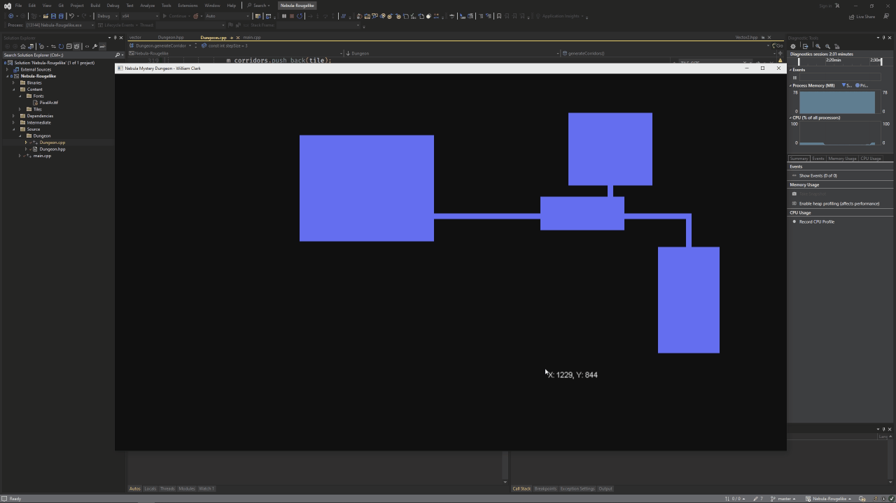

# SFML-Dungeon-Generation

This code represents a dungeon generator that generates a random dungeon layout consisting of rooms and corridors. The generated dungeon is based on a given map.

## Class: DungeonGenerator

The DungeonGenerator class is responsible for generating the dungeon layout given a map reference.

### Generation

Generating the dungeon layout is just a simple couple of executing steps:
1. Reset the dungeon for new generation

2. Reset the random number generator seed.

3. Generate rooms by iteratively trying to place a number of rooms of randoms sizes on the board without overlap against world boarders or other rooms.

4. Generate Delaunay triangulation using the center of the rooms as a vertex point.

5. Generate Minimum Spanning Tree (MST) using the Delaunay triangulation. This ensures all rooms are accessable and culls a large portion of the edges from the Delaunaytion. The MST edges will be used to infer where corridors need to connect to.

6. Add a random number of edges from Deluanay triangle to back into the MST. This will generate corridor loops within the generation

7. Generate corridors using a number of corridor algorithms that will follow the edges generated within the MST.

## Demo

